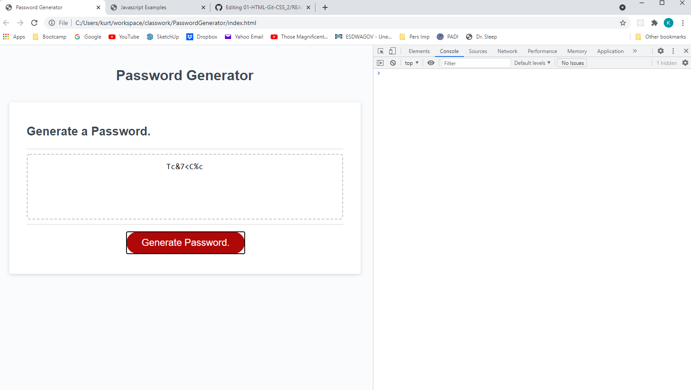

# Password Generator

# This is the submission for Password Generator homework [Password Generator](https://uwa.bootcampcontent.com/UWA-Bootcamp/uw-blv-virt-fsf-pt-07-2021-u-c/-/tree/master/03-JavaScript/02-Homework) for U/W Coding Bootcamp Full Stack Flex Program, for Kurt Heimerman.  

## This web app generates a password by prompting the user to enter the number of characters as well as the following criteria: 
* Use upper case characters
* Lower case characters
* Numeric characters
* Special characters

## The deployed app is here:  https://kurtgithubok.github.io/PasswordGenerator/

## It uses HTML and Javascript.

## The implementation consists of a 'passwordGenerator' object with a generatePassword() function.  That function calls other functions to prompt the user for input, then populate the password with at least one character from each of the criteria, the completes the password by chosing random characters from random criteria the user selected.

## The only problem faced was how to handle the user cancelling out of the prompts.

